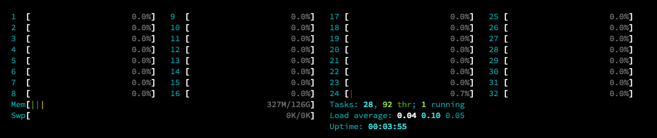
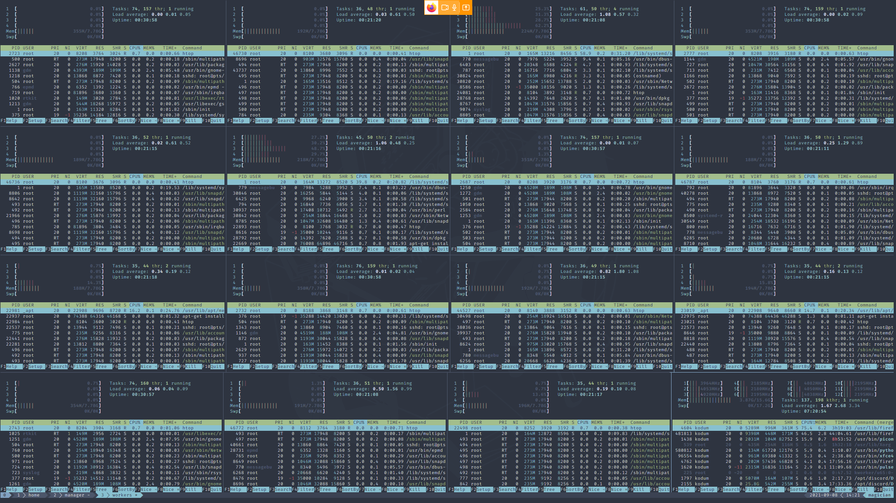
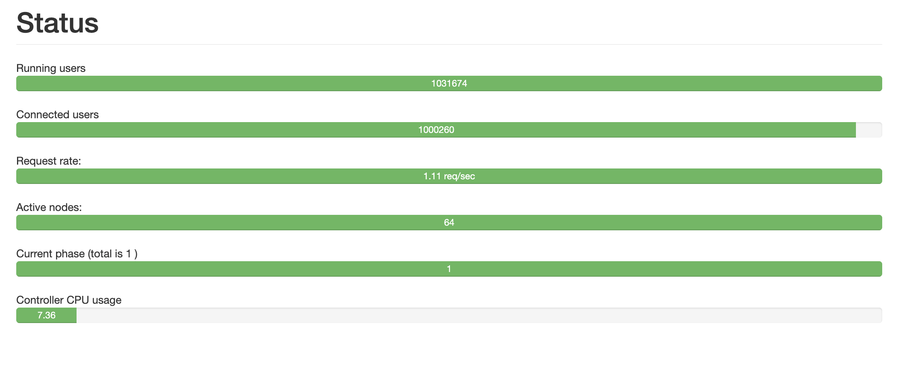

[](https://appwrite.io)

# Realtime to the 1 Million!
In our recent blog post we talked about our learnings from building a WebSocket server. Now we want to reap the fruits of our efforts and check how our server performs under tough conditions. 

Our goal was to hit 1 Million concurrent connections.

## Setup
For the WebSocket server, we used a General Purpose Droplet from DigitalOcean with 32 cores and 128 gigabytes of memory. For the clients we used 16 smaller Droplets with each 4 cores and 16 gigabytes of memory. 


To avoid any outside interference, all Droplets were created in the same data center and the benchmark was run inside an internal isolated network ([VPC](https://www.digitalocean.com/products/vpc/)) - so no traffic went outside.

For the actual benchmark we have used [Tsung](https://github.com/processone/tsung), an open-source multi-protocol distributed load testing tool to simulate users in order to test the scalability and performance of IP based client/server applications. Especially the fact that we can easily distribute the load on a cluster of client machines makes this tool extremely powerful.

In the following sections we are going to reference the client machines as the Client and the Server running Appwrite as the Manager.

## Configuration

In order for Tsung to communicate with all its client over SSH, we needed to do the following steps for each machine that will act as a client for the benchmark:

- Add a SSH key

- Set a specific hostname

  - realtime-worker-1
  - realtime-worker-2
  - …
  - realtime-worker-16

- Install Tsung

  

The SSH key added will be later used on the machine running Appwrite, which will also use Tsung in order to perform the benchmark and orchestrate all the Clients. Note, that this machine will not establish any connections to the Realtime server.

Since Tsung needs a hostname for each Client in the configuration instead of an IP, we have added all the machines to the `/etc/hosts` with its hostname and their associated IP address from the internal network.

```
10.114.0.x realtime-worker-1
10.114.0.x realtime-worker-2
....
10.114.0.x realtime-worker-15
10.114.0.x realtime-worker-16
```
After all clients have been set up, we manually connect to each Client from the Manager to add them to the `known_hosts` file. This was required, since Tsung will fail to connect otherwise.

Now we adapted our configuration file for Tsung and added all of the Clients.
```xml
<?xml version="1.0"?><tsung loglevel="debug" version="1.0">
  <clients>
    <client host="realtime-worker-1" cpu="4" use_controller_vm="false" maxusers="64000"/>
    <client host="realtime-worker-2" cpu="4" use_controller_vm="false" maxusers="64000"/>
    <client host="realtime-worker-3" cpu="4" use_controller_vm="false" maxusers="64000"/>
    <client host="realtime-worker-4" cpu="4" use_controller_vm="false" maxusers="64000"/>
    <client host="realtime-worker-5" cpu="4" use_controller_vm="false" maxusers="64000"/>
    <client host="realtime-worker-6" cpu="4" use_controller_vm="false" maxusers="64000"/>
    <client host="realtime-worker-7" cpu="4" use_controller_vm="false" maxusers="64000"/>
    <client host="realtime-worker-8" cpu="4" use_controller_vm="false" maxusers="64000"/>
    <client host="realtime-worker-9" cpu="4" use_controller_vm="false" maxusers="64000"/>
    <client host="realtime-worker-10" cpu="4" use_controller_vm="false" maxusers="64000"/>
    <client host="realtime-worker-11" cpu="4" use_controller_vm="false" maxusers="64000"/>
    <client host="realtime-worker-12" cpu="4" use_controller_vm="false" maxusers="64000"/>
    <client host="realtime-worker-13" cpu="4" use_controller_vm="false" maxusers="64000"/>
    <client host="realtime-worker-14" cpu="4" use_controller_vm="false" maxusers="64000"/>
    <client host="realtime-worker-15" cpu="4" use_controller_vm="false" maxusers="64000"/>
    <client host="realtime-worker-16" cpu="4" use_controller_vm="false" maxusers="64000"/>
   </clients>

  <servers>
    <server host="10.114.0.x" port="9505" type="tcp"/>
  </servers>

  <load>
    <arrivalphase phase="1" duration="10000" unit="second">
      <users maxnumber="2000000" arrivalrate="2000" unit="second"/>
    </arrivalphase>
  </load>

  <options>
    <option name="ports_range" min="1025" max="65535"/>
  </options>

  <sessions>
    <session name="websocket" probability="100" type="ts_websocket">
      <request>
        <websocket type="connect" path="/v1/realtime?project=console&amp;channels[]=files"/>
      </request>
      <for var="i" from="1" to="1000" incr="1">
        <thinktime value="30"/>
      </for>
    </session>
  </sessions>
</tsung>
```
As you can see inside the `<load>` tag, the `maxnumber` attribute is set to 2 Million, the reason for this is that we set a limit on the Realtime Server for 1 million connections, which we didn't wanna bottleneck. 

At that time we were under the impression, based on a GitHub issue, that [Swoole](https://www.swoole.co.uk/) our PHP framework only allows a maximum number of 1 million connections per instance. Afterwards we informed in the Swoole Community Slack, that this is not true and the real limit is 2,147,483,584 on a 64 bit machine.

The only action left to configure is the Operating System itself. Linux’s networking stack comes with sane defaults for many workloads, but the stack isn't tuned for 1+ million concurrent connections.

We expected to face some form of the [C10k problem](https://en.wikipedia.org/wiki/C10k_problem), so we prepared our systems in advance:


- Increased the default TCP buffer sizes for the system
- Increased the default IPv4 port range
- Increased the limit for open files and file handles
- and more

These configurations allow us to do roughly 64,000 connection per Client and brought us all the way to 1 million:
```sh
sysctl -w fs.file-max=12000500
sysctl -w fs.nr_open=20000500
ulimit -n 4000000
sysctl -w net.ipv4.tcp_mem="10000000 10000000 10000000"
sysctl -w net.ipv4.tcp_rmem="1024 4096 16384"
sysctl -w net.ipv4.tcp_wmem="1024 4096 16384"
sysctl -w net.ipv4.ip_local_port_range="500   65535"
sysctl -w net.core.rmem_max=16384
sysctl -w net.core.wmem_max=16384
sysctl -w net.ipv4.tcp_moderate_rcvbuf="0"
echo "root soft nofile 4000000" >> /etc/security/limits.conf
echo "root hard nofile 4000000" >> /etc/security/limits.conf
echo 20000500 > /proc/sys/fs/nr_open
```

Resources we used to tackle these limitation:
- https://www.ibm.com/support/pages/tuning-and-debugging-maximum-connections-accepted-messagesight-v20
- https://www.linkedin.com/pulse/ec2-tuning-1m-tcp-connections-using-linux-stephen-blum/
- https://cromwell-intl.com/open-source/performance-tuning/tcp.html

## Preparation

Since all of the mentioned steps need to be done on all of the Droplets we use, doing all those steps by hand would take way too long. To automate this task we used [Ansible](https://www.ansible.com/) and created a playbook that takes care of installing all necessary tools we used and the configurations for the OS.

```yml
- name: apt update and upgrade
  hosts: all
  tasks:
  - name: Update and upgrade apt packages
    apt:
      upgrade: yes
      update_cache: yes
      cache_valid_time: 86400 

  - name: Run tsung setup
    ansible.builtin.script: ./setup.sh

- name: Setup manager server
  hosts: manager
  tasks:

  - name: Install Docker
    ansible.builtin.script: ./get-docker.sh

  - name: Install Docker Compose
    get_url: 
      url : "https://github.com/docker/compose/releases/download/1.29.2/docker-compose-Linux-x86_64"
      dest: /usr/local/bin/docker-compose
      mode: 'a+x'
      force: yes

  - name: Copy private key
    ansible.builtin.copy:
      src: ./id_rsa
      dest: /root/.ssh/id_rsa
      owner: root
      group: root
      mode: '0600'

  - name: Copy tsung config
    ansible.builtin.copy:
      src: ./bench.xml
      dest: /root/bench.xml
      owner: root
      group: root
      mode: '0644'

  - name: Copy etchosts
    ansible.builtin.copy:
      src: ./etchosts
      dest: /root/etchosts
      owner: root
      group: root
      mode: '0600'

  - name: Append etchosts to /etc/hosts
    ansible.builtin.shell: cat /root/etchosts >> /etc/hosts

  - name: Clone Appwrite repo
    ansible.builtin.git:
      repo: https://github.com/appwrite/appwrite.git
      dest: /root/appwrite

- name: Copy sshkeys to workers
  hosts: workers
  tasks:
    - name: add manager public key to workers
      authorized_key:
        user: root
        state: present
        key: "{{ lookup('file', './id_rsa.pub') }}"
```

In the first section we upgraded to the latest version of all packages, installed Tsung and tweaked the OS with the `setup.sh` script on all Droplets.

Installing Tsung required us to compile it and install dependencies, for this we used following script:

```sh
apt-get install elixir build-essential gnuplot libtemplate-perl make erlang erlang-base libyaml-dev python python3-pip libssl-dev autoconf
wget http://tsung.erlang-projects.org/dist/tsung-1.7.0.tar.gz
tar -xvf tsung-1.7.0.tar.gz
cd tsung-1.7.0/
./configure
make
make install
```

The second step is preparing the Manager and does following actions:

- Install Docker
- Install Docker Compose
- Copy private SSH key
- Copy configuration file for Tsung
- Add all Clients to the `/etc/hosts` file
- Install Appwrite

Third and last step is to copy the public SSH key to all Clients, so the Manager is able to connect.

After Ansible had processed all the tasks, we could start the actual benchmark.

## The Benchmark



Looking at `htop` from the Manager with 32 cores and 128 GB of memory ready to be loaded with work is already a very nice sight. Then we started Tsung with following command:

```sh
tsung -f bench.xml -k start
```

Once the benchmark was running, we were offered a much more exciting `htop` compilation of all 16 Client.



Tsung itself offers a public website on port `8091` which provided us an easily accessible monitoring of the benchmark itself. Sadly the page was not updating in realtime, so we found ourselves refreshing the page every other second in excitement seeing the number of concurrent users connected rise.

Since we configured Tsung to establish 2000 connections every second it would take us exactly 500 seconds to reach the magic million.

After roughly 500 seconds we had done it. We had 1 Million concurrent connections to a single Realtime Server connected!



We are more than satisfied with this number, especially since in production no single real-time instance should hold that many connections anyway. Especially the load of the Manager made us happy, 16 GB of memory and 7% CPU load was used to maintain the established connections.

## Results

Since we are an open source company and want to provide as much transparency as possible, we offer all results, configuration and scripts for download. We have also prepared a web page where all results are easily accessible.

> Talk about the results and possible even higher benchmarks in the future and also share the result page we prepared => https://appwrite-reatime-preview-torstendittmann.vercel.app/